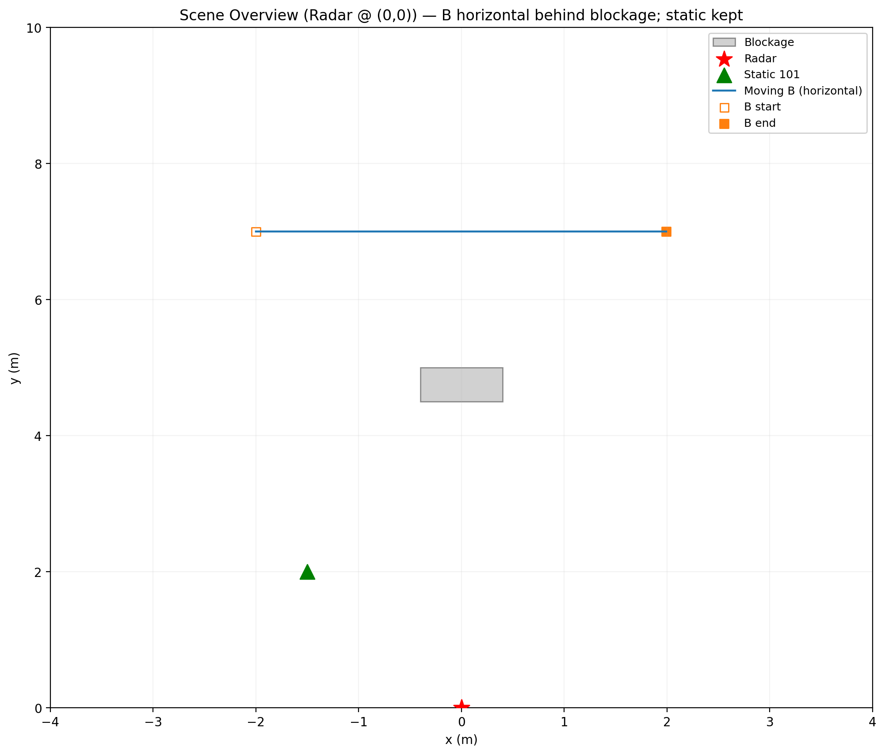
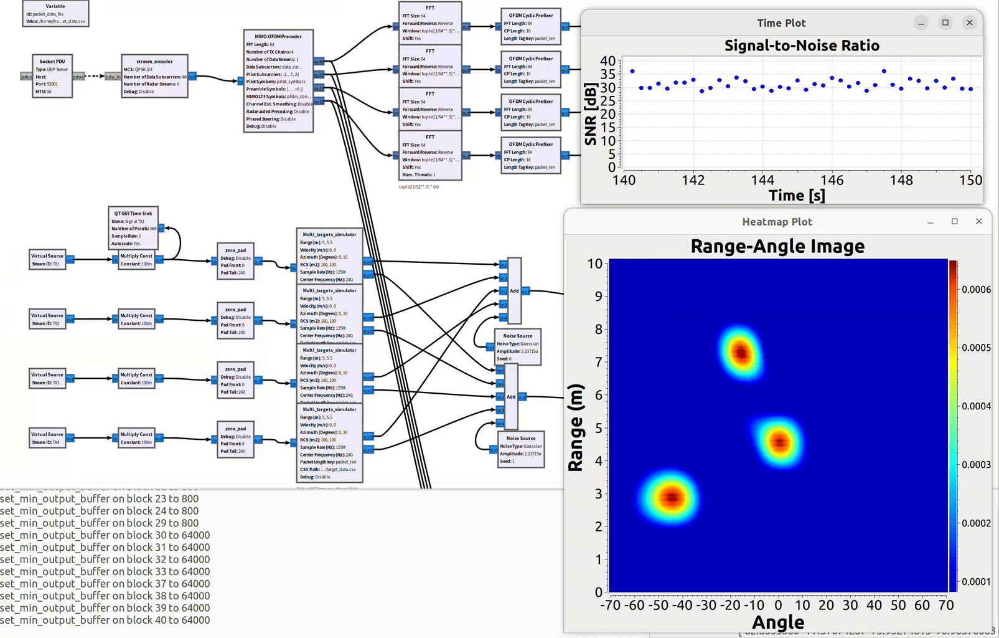

# mmWave Joint-Radar-Communication Simulator and Testbed Implementation
 
# JRC Radar + Communication Simulator

This repository provides a **Joint Radar–Communication (JRC) simulator** that integrates radar sensing and communication modules into a unified environment.

The project is **sponsored by NSF** and managed under the **AI-EDGE Institute** at **The Ohio State University**.  
For more information, please visit the [AI-EDGE Institute website](https://ai-edge.osu.edu).

The simulator requires **GNU Radio** with specific custom blocks. Please refer to our previous [O-JRC repository](https://github.com/mmWave-MIMO-Testbed/O-JRC) for details on block dependencies and installation instructions.

---

## Usage

### 1. Path Generator
Run **`Path_Generator_sim.py`** to simulate user and blockage trajectories in space.  
- Configure mobility paths, velocities, and blockage positions.  
- The script generates trajectory files and outputs a visualization figure of the environment.  

Example output:  

### 2. Radar Simulation
Run the **`v0_radar_sim`** flowgraph in GNU Radio to enable the radar simulator.  
- Use **`RadarImage_Record.py`** to record radar signatures.  
- This script writes trajectory information into `v0_radar_sim`, which then simulates the corresponding radar signatures for the environment created by `Path_Generator_sim.py`.

### 3. Communication Simulation
Run the **`v0_comm_sim`** flowgraph in GNU Radio to enable the communication simulator.  
- Use **`Comm_Record.py`** to log the communication performance of the users.  
- Communication performance only records users defined in `Path_Generator_sim.py`.

Example output:  

---

## Dependencies
- [GNU Radio](https://www.gnuradio.org/)  
- Custom O-JRC blocks (see [O-JRC repository](https://github.com/mmWave-MIMO-Testbed/O-JRC))  

---

## Acknowledgement

This research is supported in part by the U.S. National Science Foundation (**NSF**) under the AI Institute for Future Edge Networks and Distributed Intelligence (**AI-EDGE**).  
We gratefully acknowledge their support and resources that made this research possible. More details about the institute can be found at [AI-EDGE Institute](https://ai-edge.osu.edu).

